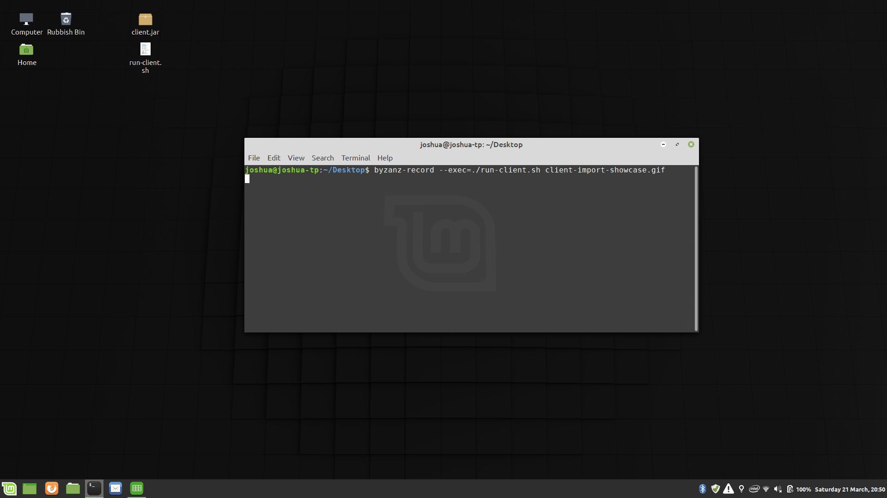

# ljw-applications

This repository contains tooling to support [LJW Aachen e.V.](http://ljw-aachen.de/) in organizational tasks. 

# Client
A GUI to manage expenses of the summer camp participants. The application supports:
- creating and editing accounts
- making money deposits and withdrawals 
- transferring money between two accounts

# Showcases
## Importing accounts
Import accounts with a balance from a CSV file.

## Managing accounts
Create and edit accounts.

## Making transactions
Make transactions; deposit, withdraw or transfer.

## Actions
Other features include cashing up and checking for accounts with a negative balance.

# Setting up
## Prerequisites
- Java 11
- Maven
## Install
- download the repository
- open a terminal in the top directory
- execute `mvn clean install -DskipTests`
## Run
- execute `java -jar client/target/client.jar`

